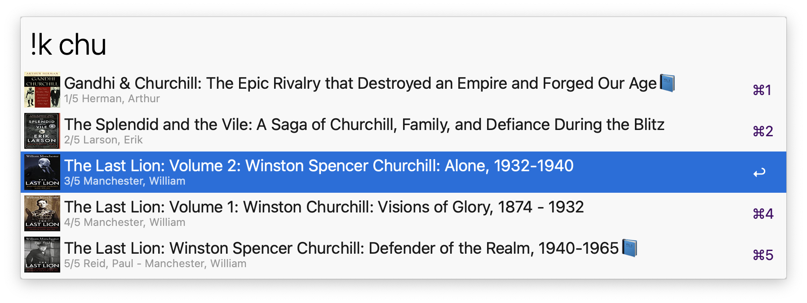

# alfred-kindle 📚

### List and open your Kindle books with [Alfred 5](https://www.alfredapp.com/) 

<a href="https://github.com/giovannicoppola/alfred-kindle/releases/latest/">
 
</a>

<!-- MarkdownTOC autolink="true" bracket="round" depth="3" autoanchor="true" -->

- [Motivation](#motivation)
- [Setting up](#setting-up)
- [Basic Usage](#usage)
- [Known Issues](#known-issues)
- [Acknowledgments](#acknowledgments)
- [Changelog](#changelog)
- [Feedback](#feedback)

<!-- /MarkdownTOC -->

<h1 id="motivation">Motivation ✅</h1>

- Quickly list, search, and open your Kindle books

<h1 id="setting-up">Setting up ⚙️</h1>

- Alfred 5 with Powerpack license
- Python3 (howto [here](https://www.freecodecamp.org/news/python-version-on-mac-update/))
- Kindle app installed

## Default settings 
- In Alfred, open the 'Configure Workflow' menu in `alfred-kindle` preferences
	- set the keyword for the workflow (default: `!k`)
	- set the book content icon, i.e. if a book has been downloaded locally.  (default: 📘)
	- show 'ghost' books (i.e. books not downloaded, or previously loaned)?  (default: yes)
	- set search scope (default: 'Title')
		- `Title`: search titles only
		- `Author`: search authors only
		- `Both`: search across titles and authors

<h1 id="usage">Basic Usage 📖</h1>

- launch with keyword (default: `!k`), or custom hotkey
- `enter` ↩️ will open the book in Kindle (if downloaded) or the corresponding webpage on Amazon (if not downloaded)

<h1 id="known-issues">Limitations & known issues ⚠️</h1>

- None for now, but I have not done extensive testing, let me know if you see anything!
- tested with ~100 books. The book list is currently created on the fly, and book covers are downloaded if missing. Might be slower if your library has thousands of books, in which case a sqlite database it might be more efficient. Let me know if that is the case! 
- tested with Python 3.9.13

<h1 id="acknowledgments">Acknowledgments 😀</h1>

- Thanks to the [Alfred forum](https://www.alfredforum.com) community!
- Icon from [SF symbols](https://developer.apple.com/sf-symbols/)

<h1 id="changelog">Changelog 🧰</h1>

- 02-28-2023: version 0.1

<h1 id="feedback">Feedback 🧐</h1>

Feedback welcome! If you notice a bug, or have ideas for new features, please feel free to get in touch either here, or on the [Alfred](https://www.alfredforum.com) forum. 
